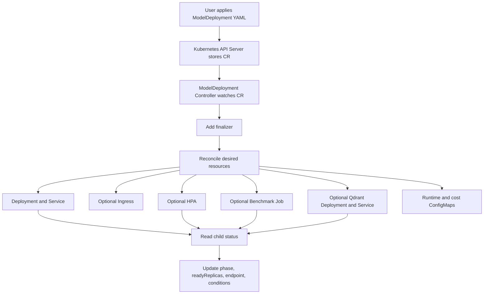
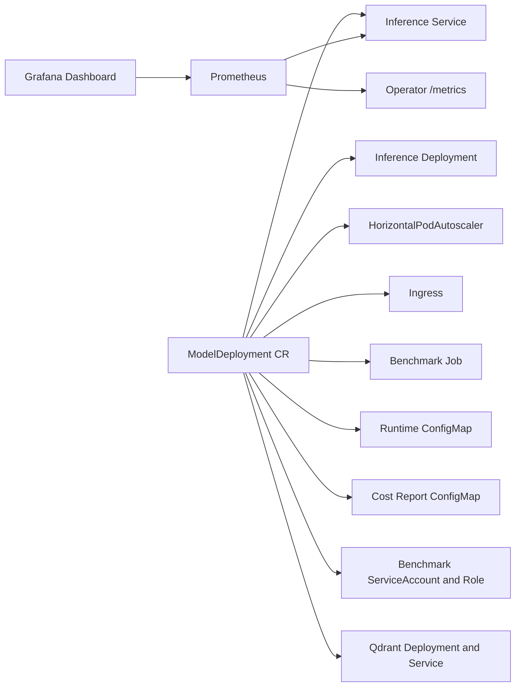
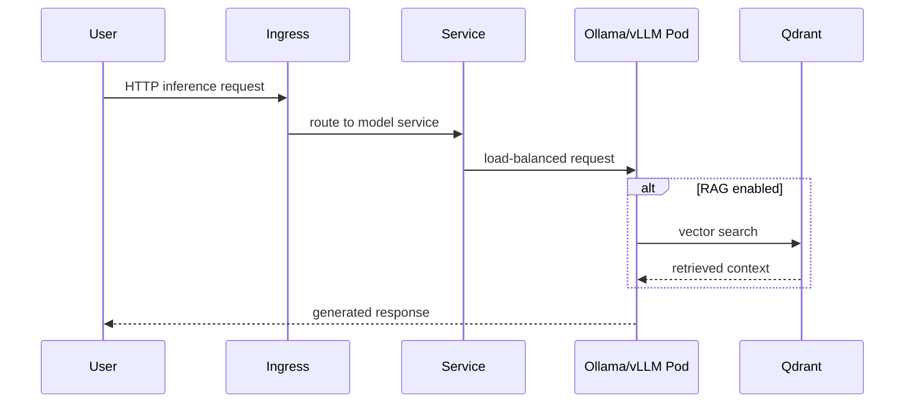
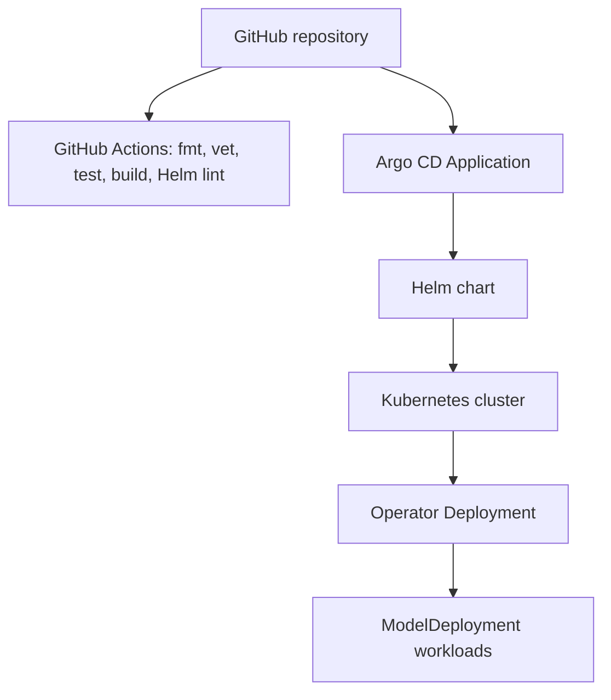

# Model Deployment Operator

A Go Kubernetes Operator for managing AI model inference workloads with CRDs, autoscaling, observability, GitOps, benchmarking, cost reporting, and local demo support.

This project is built as a production-style platform engineering portfolio project. It gives teams a `ModelDeployment` custom resource that turns a model-serving intent into Kubernetes resources such as Deployments, Services, optional Ingresses, HPAs, benchmark Jobs, ConfigMaps, and optional Qdrant resources for RAG-ready deployments.

## Why This Exists

AI inference workloads usually need more than a Pod manifest. A usable internal platform needs repeatable deployment, status, scaling, observability, security boundaries, cost visibility, failure reporting, and GitOps installation. This operator packages those concerns behind a single Kubernetes API.

## Skills Demonstrated

- Go, controller-runtime, Kubebuilder-style APIs, CRDs, reconciliation, finalizers, status conditions
- Kubernetes Deployments, Services, Ingresses, HPAs, Jobs, ConfigMaps, RBAC, NetworkPolicies
- Prometheus metrics, Grafana dashboards, benchmark result collection, controller health probes
- Helm, Argo CD, Kind demos, GitHub Actions CI, Docker builds
- MLOps and platform engineering patterns for Ollama, vLLM, and RAG-ready Qdrant dependencies

## Architecture

### Operator Reconciliation Flow



### Resource Architecture



### Request Flow



### GitOps Deployment Flow



## Features

- `ModelDeployment` CRD in `ai.platform.dev/v1alpha1`
- Ollama support implemented with model, image, replica, resource, service, ingress, observability, benchmark, secret, and RAG settings
- vLLM support implemented for Deployment arguments and example manifests
- Controller-managed Deployment, Service, optional Ingress, optional HPA, optional benchmark Job, runtime ConfigMap, cost report ConfigMap, and optional Qdrant resources
- Status phases: `Pending`, `Running`, `Degraded`, `Scaling`, `Failed`
- Status conditions and Kubernetes events for availability and failures
- Finalizer that verifies cleanup of operator-managed resources
- Benchmark binary under `cmd/benchmark` that sends requests, prints JSON, writes a result ConfigMap, and feeds `status.lastBenchmark`
- Prometheus metrics and a Grafana dashboard
- Helm chart and Argo CD Application manifest
- NetworkPolicy and cert-manager examples
- Envtest controller tests

## CRD Example

```yaml
apiVersion: ai.platform.dev/v1alpha1
kind: ModelDeployment
metadata:
  name: llama-demo
spec:
  provider: ollama
  modelName: llama3
  image: ollama/ollama:latest
  replicas: 1
  resources:
    cpu: "2"
    memory: "4Gi"
    gpu: 0
  service:
    type: ClusterIP
    port: 11434
  ingress:
    enabled: false
    host: llama.local
  autoscaling:
    enabled: true
    minReplicas: 1
    maxReplicas: 5
    targetCPUUtilizationPercentage: 70
    targetMemoryUtilizationPercentage: 80
  observability:
    enabled: true
    prometheus: true
    openTelemetry: false
  benchmark:
    enabled: true
    samplePrompt: "Explain Kubernetes operators in simple terms."
    requests: 20
    concurrency: 2
  rag:
    enabled: false
    vectorDatabase:
      provider: qdrant
      image: qdrant/qdrant:latest
  secrets:
    modelRegistrySecretName: ""
    apiTokenSecretName: ""
    providerKeySecretName: ""
```

Expected status shape:

```yaml
status:
  phase: Running
  readyReplicas: 1
  endpoint: http://llama-demo.default.svc.cluster.local:11434
  lastBenchmark:
    averageLatencyMs: 230
    p95LatencyMs: 410
    tokensPerSecond: 45
    errorRate: 0
  conditions:
    - type: Ready
      status: "True"
      reason: DeploymentAvailable
      message: Model deployment is running
```

## Quick Start

```bash
git clone https://github.com/HenishPatel1214/model-deployment-operator.git
cd model-deployment-operator
make test
make docker-build
```

Install the CRD and controller with kustomize:

```bash
kubectl apply -k config/default
kubectl apply -f examples/ollama-basic.yaml
kubectl get modeldeployments
kubectl describe modeldeployment ollama-basic
```

## Local Kind Demo

```bash
scripts/kind-create.sh
scripts/kind-load-image.sh
scripts/install.sh
scripts/demo-ollama.sh
```

Inspect the model service:

```bash
kubectl port-forward svc/ollama-benchmark 11434:11434
curl http://localhost:11434/api/tags
```

Clean up:

```bash
scripts/cleanup.sh
```

## Helm Install

```bash
helm upgrade --install model-deployment-operator charts/model-deployment-operator \
  --namespace model-deployment-operator-system \
  --create-namespace
```

Enable Prometheus Operator `ServiceMonitor` support:

```bash
helm upgrade --install model-deployment-operator charts/model-deployment-operator \
  --namespace model-deployment-operator-system \
  --create-namespace \
  --set metrics.serviceMonitor.enabled=true
```

## Argo CD Install

```bash
kubectl apply -f gitops/argocd/application.yaml
```

The Argo CD manifest points at:

```text
https://github.com/HenishPatel1214/model-deployment-operator.git
```

Update the URL if this repository is published under another account or organization.

## Observability

The controller exposes controller-runtime metrics plus custom metrics:

- `model_deployment_requests_total`
- `model_deployment_errors_total`
- `model_deployment_latency_ms`
- `model_deployment_tokens_per_second`
- `model_deployment_benchmark_duration_seconds`
- `model_deployment_ready_replicas`
- `model_deployment_status`
- `model_deployment_reconcile_errors_total`

Import `observability/grafana/model-deployment-dashboard.json` into Grafana. Prometheus Operator users can apply:

```bash
kubectl apply -f config/prometheus/servicemonitor.yaml
kubectl apply -f observability/prometheus/prometheus-rules.yaml
```

OpenTelemetry is documented as a future extension and includes a sample collector manifest in `observability/otel/collector.yaml`.

## Benchmarking

When `spec.benchmark.enabled: true`, the controller creates:

- Benchmark Job
- Result ConfigMap
- Benchmark ServiceAccount
- Role and RoleBinding limited to ConfigMap writes

The benchmark binary sends requests to the model endpoint, prints JSON to logs, and writes `result.json` into `<name>-benchmark-result`. The controller reads that ConfigMap and updates `status.lastBenchmark`.

```bash
kubectl apply -f examples/ollama-benchmark.yaml
kubectl logs job/ollama-benchmark-benchmark
kubectl get configmap ollama-benchmark-benchmark-result -o yaml
kubectl get modeldeployment ollama-benchmark -o yaml
```

## Cost And Resource Reports

The controller creates `<name>-cost-report` with a rough estimate based on requested CPU, memory, GPU, and replicas.

Placeholder pricing:

- CPU: `$0.031` per vCPU-hour
- Memory: `$0.004` per GB-hour
- GPU: `$2.50` per GPU-hour

Example:

```yaml
model: llama3
replicas: 2
cpu: 4
memoryGB: 16
gpu: 0
estimatedHourlyCost: "$0.188"
estimatedMonthlyCost: "$137.24"
```

Pricing varies by cloud provider. Treat this as a planning estimate, not billing truth.

## RAG-Ready Mode

When `spec.rag.enabled: true`, the controller creates a Qdrant Deployment and Service and injects vector database environment variables into the inference container:

- `RAG_ENABLED=true`
- `VECTOR_DATABASE_PROVIDER=qdrant`
- `VECTOR_DATABASE_ENDPOINT=http://<name>-qdrant.<namespace>.svc.cluster.local:6333`

Run:

```bash
kubectl apply -f examples/ollama-rag-qdrant.yaml
kubectl get deployment,svc -l app.kubernetes.io/instance=ollama-rag
```

The operator deploys the dependency and connection metadata. Application-level retrieval and prompt augmentation are intentionally left to the inference application.

## Security Model

- Secrets are referenced by name and never hardcoded.
- Registry credentials are wired through `imagePullSecrets`.
- API tokens and provider keys are consumed through `envFrom` secret references.
- Operator RBAC is scoped to CRDs and child resources it manages.
- Benchmark Jobs get namespace-local RBAC only for ConfigMap result writes.
- NetworkPolicy examples restrict inference traffic, Prometheus scraping, and Qdrant access.
- Optional cert-manager Ingress TLS support is included under `config/cert-manager`.

## Failure Handling

The controller inspects Deployment status and Pod container states to set `phase` and conditions.

| Scenario | Detection | Expected phase | Condition reason | Recovery |
| --- | --- | --- | --- | --- |
| Pods crash | Pod container status reports `CrashLoopBackOff` | `Failed` | `CrashLoopBackOff` | Check logs, fix image args, resource limits, or model config |
| Image fails to pull | Pod waiting reason is `ImagePullBackOff` or `ErrImagePull` | `Failed` | `ImagePullBackOff` | Fix image name, registry secret, or pull policy |
| Container exceeds memory | Last termination reason is `OOMKilled` | `Failed` | `OOMKilled` | Increase `spec.resources.memory` or lower concurrency |
| Service missing | Service is reconciled on every loop | `Pending` or `Degraded` until recreated | `DeploymentUnavailable` | Operator recreates the Service |
| HPA cannot scale | HPA conditions visible with metrics errors | `Degraded` or `Scaling` | `Scaling` | Install metrics-server or adjust targets |
| Benchmark Job fails | Job `.status.failed` increments | `Running` with `BenchmarkReady=False` | `BenchmarkFailed` | Inspect Job logs and endpoint reachability |
| Vector DB fails | Qdrant Deployment unavailable | Model may run, RAG dependency is degraded | `DeploymentUnavailable` for child resource in events | Check Qdrant image, resources, and NetworkPolicy |

Example failed image status:

```yaml
status:
  phase: Failed
  conditions:
    - type: Ready
      status: "False"
      reason: ImagePullBackOff
      message: Pod llama-demo-... container inference is waiting
```

## Testing

```bash
make fmt-check
make vet
make test
make build
make docker-build
make helm-lint
```

The controller test uses envtest and validates creation of Deployment, Service, Ingress, HPA, benchmark Job, Qdrant resources, cost/result ConfigMaps, finalizer behavior, status updates, and deletion cleanup.

## CI/CD

`.github/workflows/ci.yml` runs:

- Go formatting check
- Manifest generation
- Go vet
- Envtest tests
- Controller and benchmark build
- Docker build
- Helm lint
- YAML validation

## Roadmap

- Publish versioned operator and benchmark container images
- Add KEDA integration for request rate, queue depth, and token throughput scaling
- Add OpenTelemetry traces emitted by the benchmark and inference adapters
- Add provider-specific startup hooks for pulling Ollama models
- Add richer status summaries for Qdrant and HPA condition details
- Add admission webhooks for validation and defaults

## Resume Bullets

- Built a Kubernetes Operator in Go using controller-runtime to manage AI model inference workloads through a custom `ModelDeployment` CRD.
- Implemented reconciliation logic for Deployments, Services, HPAs, benchmark Jobs, Qdrant dependencies, status conditions, ConfigMaps, and finalizers.
- Added Prometheus/Grafana observability for inference latency, request volume, token throughput, errors, benchmark duration, model phase, and ready replicas.
- Designed GitOps deployment using Helm and Argo CD with GitHub Actions CI for testing, linting, manifest generation, Docker builds, and YAML validation.
- Implemented secure Kubernetes patterns including scoped RBAC, namespace-local benchmark permissions, NetworkPolicies, secret references, and optional TLS support.

## Demo Video Placeholder

Record a short demo that shows:

1. Creating a Kind cluster
2. Installing the operator
3. Applying `examples/ollama-benchmark.yaml`
4. Inspecting generated resources
5. Viewing benchmark logs and status
6. Deleting the CR and showing finalizer cleanup

Place the GIF at `docs/images/demo.gif` and link it here after recording.

## Contributing

Contributions should include a focused change, tests for controller behavior when relevant, and documentation updates for new CRD fields or generated resources.

## Implemented vs Future Work

Fully implemented:

- Go API types, controller, resource builders, finalizer, status updates, events, metrics, cost report, benchmark binary, result ConfigMap, Qdrant dependency deployment, examples, Helm, Argo CD, NetworkPolicies, docs, CI.

Documented as future work:

- KEDA event-driven scaling, OpenTelemetry traces from model servers, admission webhooks, real cloud pricing integration, and deep application-level RAG prompt augmentation.
